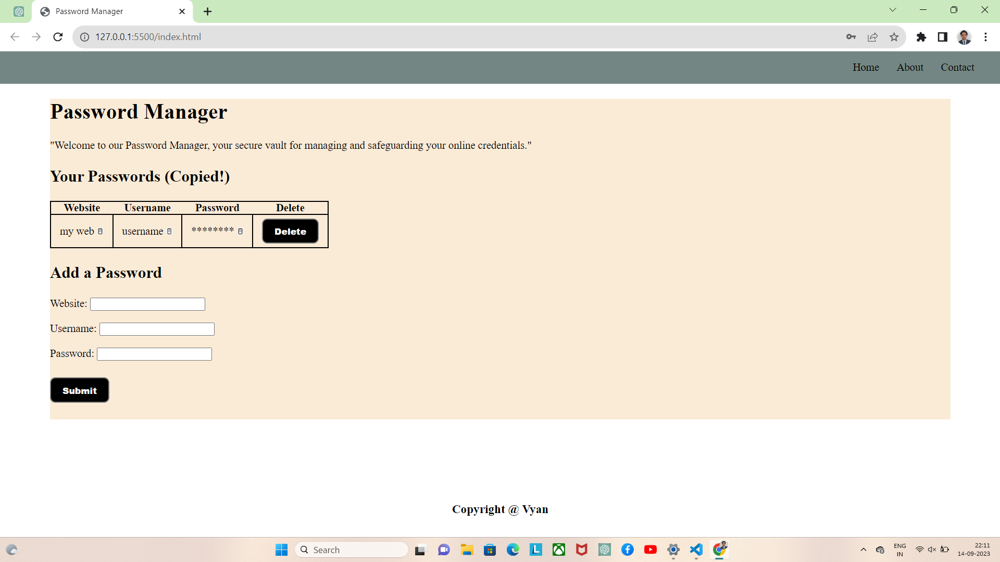

# Password Manager

## Description

The Password Manager is a simple web-based application that allows users to securely store and manage their online credentials. It provides a user-friendly interface to add, view, and delete password entries for various websites.

## Features

- Add new passwords with website, username, and password fields.
- View a list of saved passwords with the ability to copy them to the clipboard.
- Delete passwords for websites you no longer need.

## Getting Started

These instructions will help you set up and run the Password Manager on your local machine for development and testing purposes.

### Prerequisites

- [Web browser](https://www.google.com/chrome/) - Any modern web browser that supports JavaScript.
